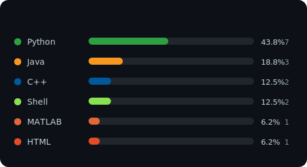

  
  

 

  

---

<h3 align="center">Languages & Tools</h3>

  

---

<picture>
  <source media="(prefers-color-scheme: dark)" srcset="./images/github-snake-dark.svg" />
  <source media="(prefers-color-scheme: light)" srcset="./images/github-snake.svg" />
  
</picture>

---

